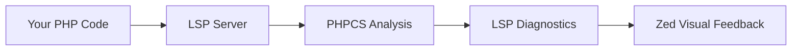

# 🎯 PHPCS LSP for Zed Editor

> **Transform your PHP coding experience** with real-time code quality checking directly in Zed Editor

[](LICENSE)
[](https://php.net)
[](https://zed.dev)
[](https://github.com/squizlabs/PHP_CodeSniffer)

**Never ship messy PHP code again!** This extension brings the power of PHP_CodeSniffer directly into your Zed workflow, highlighting code style violations as you type and helping you maintain consistent, professional code quality.

---

## ✨ Why You'll Love This Extension

### 🔍 **Instant Feedback**
See code style violations the moment you type them - no more waiting for CI/CD to catch simple formatting issues.

### ⚡ **Zero Setup Required**
Works immediately with sensible defaults. No configuration files, no complex setup - just install and code.

### 🎨 **Crystal Clear Visual Cues**
- 🔴 **Red underlines** for critical errors that break standards
- 🟡 **Yellow underlines** for warnings and style suggestions
- 🟢 **Green** when your code is clean and compliant

### 🚀 **Lightning Fast Performance**
Uses advanced stdin processing to analyze your code without file system delays or race conditions.

### 🔧 **Incredibly Flexible**
From PSR-12 defaults to complex custom rulesets - configure it exactly how your team works.

---

## 🚀 Get Started in 30 Seconds

### 1. **Install & Open**
```bash
# Install the extension (coming soon to Zed marketplace)
# For now: manual installation for early adopters

# Open any PHP project
zed your-awesome-php-project/
```

### 2. **See the Magic Happen**
The extension immediately starts analyzing your code:

```php
<?php
// ❌ This will show instant red underlines
if($messy==true){echo"bad style";}

// ✅ This gets a clean green light
if ($clean === true) {
    echo "beautiful code";
}
```

### 3. **Customize (Optional)**
Want different standards? Just add a `phpcs.xml` to your project or configure via Zed settings. That's it!

---

## 🎨 Supported Coding Standards

| Standard | Description | Best For |
|----------|-------------|----------|
| **PSR-12** ⭐ | Modern PHP standard (default) | New projects, modern codebases |
| **PSR-2** | Legacy coding style guide | Maintaining older projects |
| **PSR-1** | Basic coding fundamentals | Learning PHP best practices |
| **Squiz** | Comprehensive enterprise rules | Large teams, strict quality |
| **PEAR** | Classic PHP standard | Legacy PEAR projects |
| **Zend** | Framework-specific rules | Zend/Laminas projects |
| **Custom** | Your own rules | Unique team requirements |

---

## ⚙️ Configuration Made Simple

> **Tip:** Most users won't need any configuration - the extension works great out of the box!

### 🔄 **Automatic Discovery** (Recommended)

**Just works!** The extension intelligently finds the best configuration:

1. 📁 **Project Rules** → Looks for `phpcs.xml` in your project
2. 📦 **Bundled PHPCS** → Uses the included, always-updated version
3. 🌍 **System Installation** → Falls back to your global PHPCS
4. ✨ **Smart Defaults** → PSR-12 when nothing else is found

### 🎛️ **Custom Standards** (Power Users)

Want to mix and match standards? Easy! Configure in your Zed `settings.json`:

```json
{
  "lsp": {
    "phpcs-lsp-server": {
      "settings": {
        // 🎯 Single standard
        "standard": "PSR12",
        
        // 🎭 Multiple standards  
        "standard": ["PSR12", "Squiz.Commenting"],
        
        // 📄 Custom ruleset
        "standard": "./our-awesome-rules.xml",
        
        // 🌈 Mix everything
        "standard": ["PSR12", "./custom.xml", "Generic.Files.LineLength"]
      }
    }
  }
}
```

### 🛠️ **Custom PHPCS Executable** (Advanced)

Need a specific PHPCS version? No problem:

```json
{
  "lsp": {
    "phpcs-lsp-server": {
      "settings": {
        "phpcsPath": "/your/special/phpcs",
        "phpcbfPath": "/your/special/phpcbf"
      }
    }
  }
}
```

### 🔧 **Environment Variables** (Legacy Support)

For scripting or CI environments:

```bash
export PHPCS_STANDARD="PSR12,Squiz.Commenting"
export PHPCS_PATH="/custom/phpcs"
export PHPCBF_PATH="/custom/phpcbf"
```

---

## 🏗️ Project-Level Configuration

### 📋 **Create Your Ruleset**

Drop a `phpcs.xml` in your project root for team-wide consistency:

```xml
<?xml version="1.0"?>
<ruleset name="Our Awesome Project Standards">
    <description>Code standards that make our team productive</description>
    
    <!-- Start with PSR-12 foundation -->
    <rule ref="PSR12"/>
    
    <!-- Customize line length for modern screens -->
    <rule ref="Generic.Files.LineLength">
        <properties>
            <property name="lineLimit" value="120"/>
        </properties>
    </rule>
    
    <!-- Skip the noise - exclude vendor and generated files -->
    <exclude-pattern>*/vendor/*</exclude-pattern>
    <exclude-pattern>*/storage/*</exclude-pattern>
    <exclude-pattern>*/bootstrap/cache/*</exclude-pattern>
</ruleset>
```

### 🎯 **Priority System** (How the Extension Decides)

1. 🎛️ **Your Zed Settings** - Ultimate control
2. 🌍 **Environment Variables** - Great for CI/scripts  
3. 📄 **Project phpcs.xml** - Team consistency
4. ✨ **PSR-12 Default** - Sensible fallback

---

## 🔧 Development & Contributing

### 🚀 **Building from Source**

```bash
# Get the code
git clone https://github.com/mikebronner/zed-phpcs-lsp.git
cd zed-phpcs-lsp

# Build everything
./build.sh

# Link for development
ln -s "$(pwd)" ~/.config/zed/extensions/phpcs-lsp
```

### 🏗️ **Project Architecture**

```
zed-phpcs-lsp/
├── 🦀 src/lib.rs              # Zed extension (Rust → WASM)
├── 🌐 lsp-server/src/main.rs  # LSP server (performance-critical)
├── 📦 bin/                    # Cross-platform binaries
├── ⚙️  extension.toml          # Extension metadata  
├── 🔨 build.sh               # One-click build script
└── 🧪 test.php               # Validation test file
```

### 🤝 **How to Contribute**

We'd love your help making this extension even better!

- 🐛 **Found a bug?** [Open an issue](https://github.com/mikebronner/zed-phpcs-lsp/issues)
- 💡 **Have an idea?** [Start a discussion](https://github.com/mikebronner/zed-phpcs-lsp/discussions)
- 🔧 **Want to code?** Fork, improve, and submit a PR
- 📖 **Love writing?** Help us improve this documentation

---

## 🎯 How It Works (The Magic Behind the Scenes)



1. **⚡ Real-time Analysis** - Content streams to PHPCS via stdin for instant feedback
2. **🔄 LSP Translation** - PHPCS output converts to Language Server Protocol diagnostics  
3. **🎨 Visual Magic** - Diagnostics appear as beautiful underlines in your editor
4. **🚀 Performance** - No temporary files means no race conditions or delays

---

## 🏆 Why Choose This Over Alternatives?

| Feature | PHPCS LSP | VS Code PHP | PhpStorm | Generic Linters |
|---------|-----------|-------------|----------|-----------------|
| ⚡ Real-time feedback | ✅ Instant | ✅ Good | ✅ Excellent | ❌ Manual |
| 🔧 Zero configuration | ✅ Works immediately | ❌ Complex setup | ✅ Built-in | ❌ Requires setup |
| 🎨 Visual clarity | ✅ Beautiful underlines | ✅ Good | ✅ Excellent | ⚠️ Basic |
| 🚀 Performance | ✅ Lightning fast | ⚠️ Can be slow | ✅ Very fast | ⚠️ Varies |
| 💰 Cost | ✅ Free forever | ✅ Free | ❌ Paid license | ✅ Usually free |
| 🔄 Auto-updates | ✅ Seamless | ⚠️ Manual | ✅ Automatic | ❌ Manual |

---

## 🆘 Troubleshooting

### **Extension Not Working?**

1. **Check the logs**: Zed → View → Debug Console
2. **Verify PHPCS**: The extension includes PHPCS, but custom paths need to exist
3. **Restart Zed**: Sometimes a restart helps after configuration changes

### **Not Seeing Diagnostics?**

1. **Check file extension**: Only `.php` files are analyzed
2. **Verify standards**: Make sure your configured standard exists
3. **Test with simple file**: Create a test file with obvious style violations

### **Custom Rules Not Working?**

1. **Check phpcs.xml syntax**: Validate your XML is well-formed
2. **Verify paths**: Relative paths are relative to your project root
3. **Test manually**: Run `phpcs --config-show` to verify your setup

---

## 📚 Learn More

- 📖 [PHP_CodeSniffer Documentation](https://github.com/squizlabs/PHP_CodeSniffer/wiki)
- 🎯 [PSR Standards](https://www.php-fig.org/psr/)
- ⚡ [Zed Editor](https://zed.dev)
- 🦀 [Tower LSP (Rust Framework)](https://github.com/ebkalderon/tower-lsp)

---

## 📄 License

This project is licensed under the MIT License - see the [LICENSE](LICENSE) file for details.

---

## 🙏 Credits & Acknowledgments

This extension stands on the shoulders of giants:

- **🏆 [PHP_CodeSniffer](https://github.com/squizlabs/PHP_CodeSniffer)** - The phenomenal tool that powers our analysis
- **⚡ [Zed Editor](https://zed.dev)** - The blazing-fast editor that makes this all possible  
- **🦀 [Tower LSP](https://github.com/ebkalderon/tower-lsp)** - The robust Rust framework for LSP servers
- **🌟 The PHP Community** - For creating and maintaining excellent coding standards

---

<div align="center">

### **Ready to Write Better PHP?**

**Install the extension and experience the difference instantly!**

[⭐ Star This Project](https://github.com/mikebronner/zed-phpcs-lsp) • [🐛 Report Issues](https://github.com/mikebronner/zed-phpcs-lsp/issues) • [💬 Join Discussions](https://github.com/mikebronner/zed-phpcs-lsp/discussions)

---

**Made with ❤️ and lots of ☕ for the PHP community**

*Transform your code quality today - your future self (and your team) will thank you!*

</div>